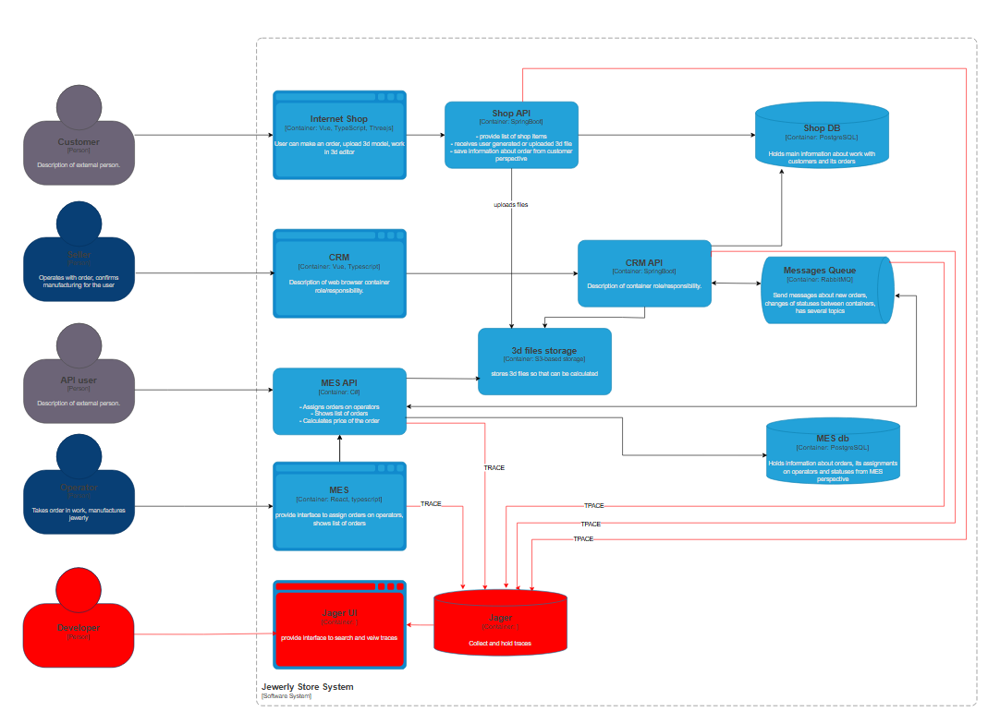

## Cистемы, которые следует покрыть трейсингом. 
В первую очередь покрыть сервисы, взаимодействущие при обработке заказов для их отслеживания.

* Shop API - так как жалутся пользователи, что не получили заказов
* CRM API - api пользователи жалутся на неполучение заказов, которые заводятся через CRM API
* MES API - наиболее загруженная часть системы, долго обрабатывает  заказы, нужно подтвердить предполагаемые узкие места.
* Очередь сообщений - вероятно, часть сообщений теряется, нужна детальная диагностика 
вероятно, часть сообщений теряется
* MES UI

## Места, где заказ может «сломаться» или зависнуть.

* Очередь сообщений - вероятно, часть сообщений теряется
* MES API /MES UI - предположительно данные о заказах не доходят/не отображаются операторам поэтому не берутся в работу

## Список данных, которые должны попадать в трейсинг.
- идентификатор трассы;
- идентификатор шага;
- имя сервиса, выполняющего операцию;
- время начала шага
- время завершения шага;
- длительность шага;
- идентификатор пользователя, участника процесса;
- идентификатор заказа;
- текущий статус заказа;
- сервис первоисточник заказа;
- размер 3D-модели;
- количество полигонов 3D-модели;
- расчётна стоимость;
- время расчёта стоимости;
- тип ошибки
- описание ошибки;
- связанные логи уровня warning/error.

## Мотивация
1. Компания теряет заказы, но команда не может локализовать точного проблемного места и причины вынуждена вносить именения исходя из предположений, что влечёт напрасные траты ресурсов на избыточные изменения.
2. Даже после внесения изменений может быть не до конца понятен эффект, поскольку детально подтвердит, что именно пробленый участок(сервис) был оптимизирован верно и не ухудшил ситуацию на других участках, возможность отсутствует. 

## Предлагаемое решение

* Встроить sdk OTel в сервисы Shop API,CRM API,MES API, в MES UI
* Добавить и поля и настроить трассировку очереди.
* Развернуть Jaeger для поиска и просмотров трасс.

[Cхема C4 c компонентами трассировки](https://github.com/ZergZet/architecture--alexandrite/blob/Monitoring/Task3/Task3.jewerly_c4_model.drawio)

## Компромиссы. В каких случаях трейсинг не принесёт пользы, пока невозможен, или его реализация обойдётся слишком дорого.
Например, сложно заставить проприетарную систему отдавать метрики в нужном формате, может потребоваться дорогостоящая доработка.

## Аспекты безопасности. 

* ограничение доступа к сегменту сервисов трассировки
* обеспечить маскирование чувствительной информации при попадании в трассы
* передача трасс по защищённому каналу
* аутентификация доступа к трассам
* Ролевое разграничение доступа к управлению, хранению трасс.
