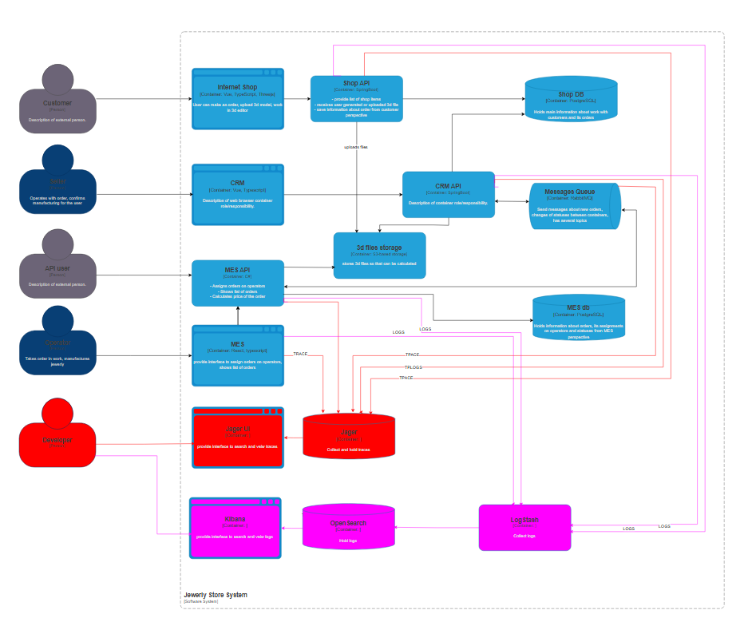

# Анализ системы компании в контексте планирования логирования

## Какие логи нужно собирать, из каких систем требуется сбор логов.
 Наиболее проблемные системы, для которых требуется настройка сбора логов в первую очередь
 - Shop API 
  * * создание заказа, 
  * * загрузка 3D-модели для расчёта
  * * добавление новых пользователей.
 - CRM API  
 * * подтверждение заказа, 
 * * логирование текущего статусов, 
 * * взаимодействие с очередь.
 - MES API 
 * * расчёт цены, назначение заказа оператору, 
 * * логирование изменений  статусов,
 * * построение дашборда.
 - Очередь сообщений
 * * системные логи брокера сообщений,
 * * недоставленные сообщения,
 * * повторные отправки сообщений.
 -  MES DB
  * * медленные запросы.

## Список необходимых логов с уровнем INFO ( штатное поведение ). 

- Создание заказа, логируем: дата/время начала, дата/время завершения, идентификатор покупателя, номер заказа, результат;
- загрузка 3D-модели для расчёта, логируем: имя файла, размер, кол-во полигонов, идентификатор покупателя, идентификатор заказа, результат;
- добавление новых пользователей, логируем: дата/время начала, дата/время завершения, идентификатор пользователя, результат;
- подтверждение заказа, логируем: время, идентификатор покупателя, номер заказа, результат;
- логирование текущего статусов, логируем: дата/время, идентификатор заказа, текущий статус;
- взаимодействие с очередь, логируем: дата/время начала, дата/время завершения,идентификатор сообщения, источник/приёмник сообщения, результат;
- расчёт цены, назначение заказа оператору, логируем:дата/время начала, дата/время завершения, идентификатор заказа, время расчёта, реззультат;
- логирование изменений статусов, логируем: дата/время начала, дата/время завершения, идентификатор заказа, предыдущий статус, текущий статус, результат;
- построение дашборда, логируем: дата/время начала, длительность, объём полученных данных, результат;
- системные логи брокера сообщений, логируем: дата/время начала, дата/время завершения, информация по операции, результат;
- недоставленные сообщения, логируем: дата/время начала, дата/время завершения, источник/приёмник сообщения, идентификатор сообщения;
- повторные отправки сообщений, логируем: дата/время начала, дата/время завершения, источник/приёмник сообщения, идентификатор сообщения, идентификатор заказа, результат;
- медленные запросы, логируем: дата/время начала, дата/время завершения, длительность, объём данных, результат;

## обстоятельства использования других уровней логирования

* Логирование уровня FATAL, ERROR, WARN входят в подмножество логов INFO
* Логирование уровня DEBUG и TRACE будет использовано в разработческом сегменте для диагностики проблемы, связанные с обработкой данных. 
* Логирование WARN могут быть испльзованы в prod сегменте при подозрениях на угрозы или нестандартном поведении.

# Мотивация
 - Детальное логирование позволит быстрее выявлять первопричины проблем,на которые жалуется пользователь.
 - На проде поможет с расследование подозрительно активности отдельных пользователей.
 - Детальное логирование временных характеристик исполнения позволит выявить узкие места  - конкретных алгоритмов и добиться повышения производительности.
 - Ускорение процессе устранения проблем поможет улучшить пользовательсякий опыт и лояльность потребителей.

Так как команда не сможет реализовать единовременно логирование и трейсинг всех выделенных для этого систем, то наравне с трейсингом для перечиаленных ранее компонент, логирование в первую очередь потребуется для наиболее загруженного сервиса MES API для детального отслеживания его состояния, отладки и контроля прохождения запросов, а также логирование очереди для отслеживания возможных потерь сообщений с заказами.

# Предлагаемое решение

[Компоненты логирования и новые связи на схеме](https://github.com/ZergZet/architecture--alexandrite/blob/Monitoring/Task4/Task4.jewerly_c4_model.drawio)

Перечисленные приложения записыват данные в лог файлы:
- MES API (C#)
- Очередь сообщений
- Shop API (Java Spring Boot)
- CRM API (Java Spring Boot)

Сообщения, отлавливает filebeat, собирает Logstash, хранит и обрабатывает OpenSearch, отображает Kibana.

## Политика безопасности логов

Чувствительные данные не логируем:
ФИО, email, телефон, банковские карты, адреса, пароли, токены доступа и т.п.

Доступ к логам.
- Разработчики, DevOps: полный доступ ко всем логам.
- Поддержка: доступ на чтение к INFO-логам. 
- Операторы, партнёры — нет доступа.

## Политика хранения логов 
- отдельный индекс для каждого сервиса для логов WARN и ниже
- отдельный индекс за каждый день для отладочных логов DEBUG и TRACE 

- Логи уровня WARN и ниже будут храниться до 30 дней или до 50Гб на индекс для выявления аномалий
- логои DEBUG и TRACE храниться не более недели или не более 50ГБ на индекс.
- При использовании логов в исследовании/отладки проблем, до окончания/прекращения исследования. 

# Мероприятия для превращения системы сбора логов в систему анализа логов:
- Для быстрого реагирования стоит настроить отправку уведомлений при появлении чрезмерного количества ошибок, отказов доставки сообщений, повторящихся длительных расчётов моделей

- Для поиска и выявления анномалий уже потребуется подклчить и обучить ML модель, чтобы выявлятьнештатное поведение сервисов, отклонения при прохождении заказов и потенциальные оттаки , направленные на отказ в обслуживании, так как это длительный процесс, требуещий определённой квалификации исполнителей и дополнительных инвестиций, его внедрение разумно инициировать после решения насущных проблем информационных систем компании.
