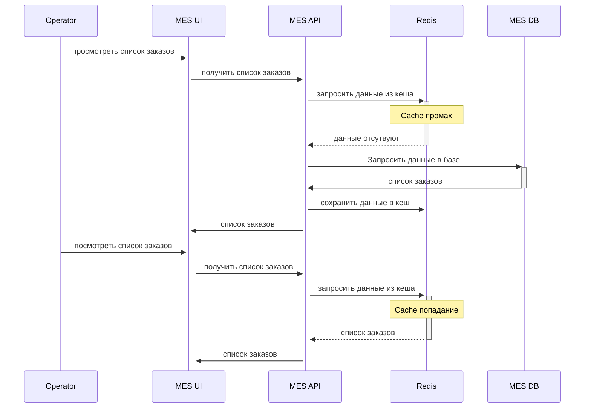
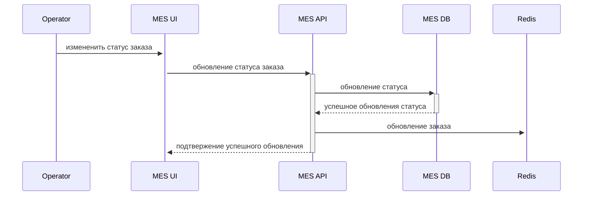

# Выбор части системы для закеширования.
# Мотивация
 Операторы жалутся, что не получают информации о новых заказах, при недозагруженности производста, при этом пользователи ждут заказы месяцами, из-за чего бизнес недополучает доходы,а клиенты уходят к конкурентам.
 
 Одной из причин является медленная загрузка главной страницы, крайне медленно и с ограничениями строящая отчёт по информации из базы данных. Для ускорения получения данной информации предлагается внедрить кеширование, которое должно решить проблему как медленной загрузки, так неактуальных данных главной страницы приложения после отката/обновления внедрённой пагинации.

# Предлагаемое решение
 Клиентское кеширование для решения проблемы не подойдёт, так как основная потребность помимо быстрой загрузки страницы - видеть актуальные данные (какой оператор первым возьмёт заказ, тот на нем и заработает), а значит кеш должен иметь минимально возможное расхождение с данными в базе для всех пользователей, частое обновление кешей нивелирует преимущество клиентского кеширования.
 
 В из приложения MES UI превалируют операции чтения для регулярного отображения новых заказов на панелях мониторинга MES, списки новых заказов, списки заказов со статусами, данные по заказам обновлятся, и и растут, но с не слишком большой частотой (+100 закадов в месяц).

Выбор паттерна серверного кеширования: 
| Cache-Aside:            | Refresh-Ahead            |Write-Through                         |
|-------------------------|--------------------------|--------------------------------------|
| Просто в реализации     | хорош для предсказуемых обновлений  | информация в кеше может быть неактуальной |
| требует обновления по TTL или(и) ключу | промах при первом запросе | Данные между кешем и базой данных всегда будут синхронизированы |
|                         | модель данных кеша должна совпадать с БД               | кеширование записи создаст избыточную нагрузку при изменении связанных списков с фильтрами |

Вывод:
 
 почему вы выбрали этот паттерн и почему остальные паттерны не подойдут или покажут себя хуже.

Sequence diagram операция чтения списка заказов с указанием всех сущностей, участвующих в кешировании

- Cache промах и Cache попадание

- Sequence diagram записи об изменении статуса заказа с указанием всех сущностей, участвующих в кешировании. 

## Cтратегию инвалидации кеша
 
| Стратегия       | Плюсы                | Минусы                                    |
|-----------------|----------------------|-------------------------------------------|
| Временная инвалидация | снижает нагрузку на базу и при этом сохраняет достаточную актуальность отображаемого списка, прост в реализации | информация в кеше о новых заказах может быть неактуальной до обновления по TTL |
| Инвалидация по ключу        | высокая актуальность, обновляется точечно по идентификатору заказа | требует контроля , если ключ не был удалён               |
|Программная инвалидация|гибкое управление при именениях для сложной логики приложений |сложнее в реализации, избыточно для простых приложений|
|Инвалидация на запросах| применима к фильтрам |не имеет смысла для однотипных запросов|

Предлагается использовать инвалидацию по ключу для точечного обновления данных о изменениях конкретных заказах, что снизит нагрузку на систему и временную инвалидацию для получения списков новых заказов, подстраховав от пропуска событий. 